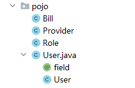
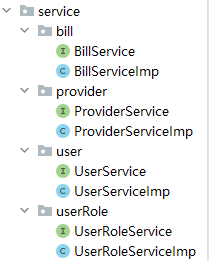
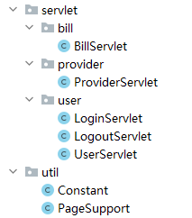
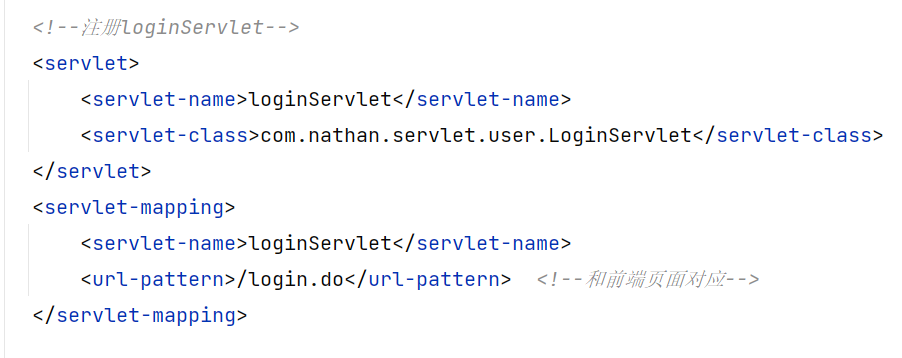

## 超市订单管理系统搭建流程
### 1. 新建maven项目，导包
  junit、javax.servlet、javax.servlet.jsp、jstl、mysql、taglibs、fastjson.
### 2. 编写接口以及对应的类
#### 2.1 DAO

#### 2.2 POJO

#### 2.3 Service

#### 2.4 Servlet
有关Servlet的类在编写完成时应该立即在web.xml中注册，且url-pattern应与前端所使用的名称一致。




#### 2.5 Util

### 3. 配置pom.xml以便将.xml、.properties文件类型加载到程序中
```java 
<resources>
    <resource>
        <directory>JavaProject/src/main/resources</directory>
            <includes>
                 <include>**/*.properties</include>
                 <include>**/*.xml</include>
            </includes>
    </resource>
    <resource>
        <directory>JavaProject/src/main/java</directory>
            <includes>
                <include>**/*.properties</include>
                <include>**/*.xml</include>
            </includes>
        <filtering>true</filtering>
    </resource>
</resources>
```
### 4. 出现的问题
#### 4.1 .properties文件在load时无法加载，出现inputStream为null的情况
BaseDao中直接将静态代码块改成以下代码，后续的getConnection函数中Class.forName将会正常运行。
```html
static {
    driver = "com.mysql.cj.jdbc.Driver";
    url = "jdbc:mysql://localhost:3306/smbms?useSSL=true&useUnicode=true&characterEncoding=UTF-8";
    username = "root";
    password = "123456";
}
```
#### 4.2 网页上某些供应商名称不能正确显示
BillServlet.query方法中，使用
```html 
providerService.getProviderById(""+bill.getProviderId()).getProName();
```
无法获得供应商名称，提示输入到getProviderById的参数为null，后续使用双层for循环可以解决大部分问题，但同时会造成网页加载缓慢的问题。
```html
for (Bill bill : billList) {
    for (Provider provider : providerList) {
        if (provider.getId().equals(bill.getProviderId())) {
        bill.setProviderName(provider.getProName());
        }
    }
}
```
#### 4.3 UserServlet中的updatePassword方法不起作用